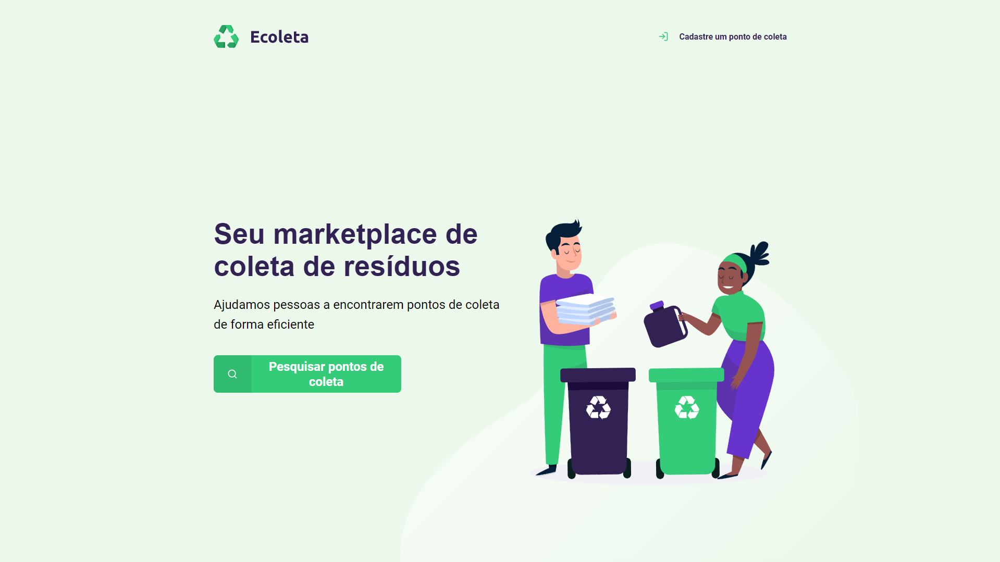
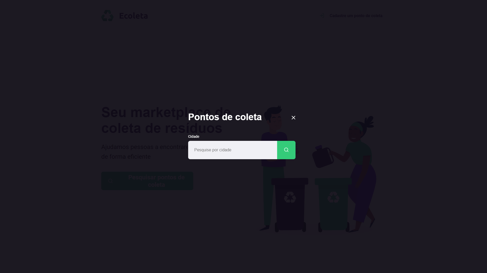
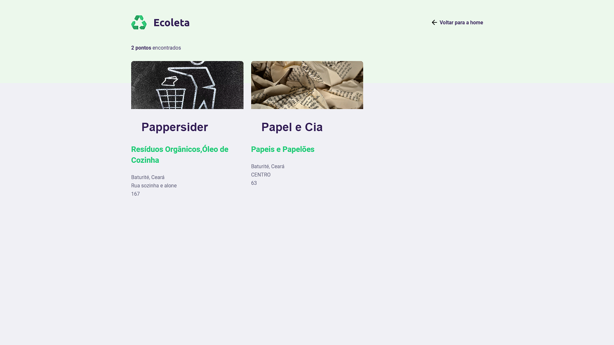
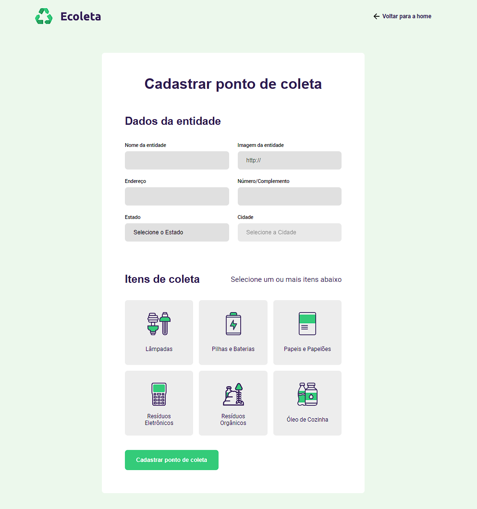

# NLW_01 ECOLETA discover❤
Aplicação com intuito de ajudar você a descartar seu lixo de forma certa e bem perto de você. 

## 📃 PÁGINAS:

Index

Modal: Página responsável por realizar a pesquisa dos pontos de coleta (pesquisa por cidade)

Resultado de Busca: Exibição dos pontos encontrados

Criar ponto: Página para cadastro de novos pontos de coleta.

## 🛠️ Construído com:

* [ html - css - javascript ](https://developer.mozilla.org/pt-BR/docs/Web/HTML) - Tecnologias.
* [ Nunjucks ](https://mozilla.github.io/nunjucks/) - Nunjucks js.
* [ Express ](https://expressjs.com/pt-br/) - Express js.

## ✒️ Autores

* **Nailson** - [Dev](https://github.com/nailsonlima)

## 🎁 Expressões de gratidão

* Obrigado pelo seu tempo!

---
Feito com ❤️ por [Nailson Lima](https://gist.github.com/nailsonlima)
